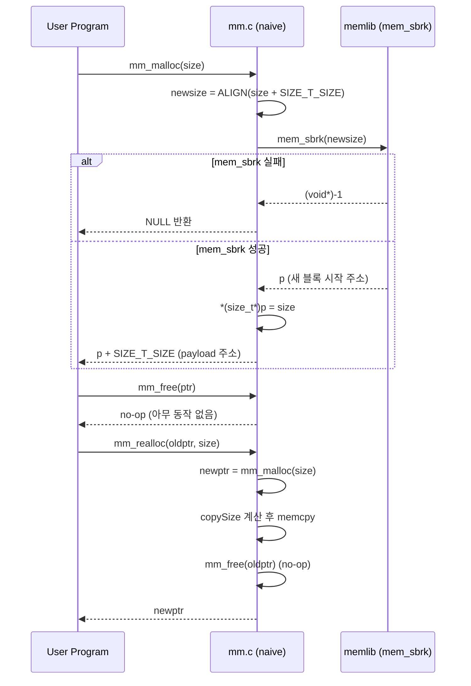
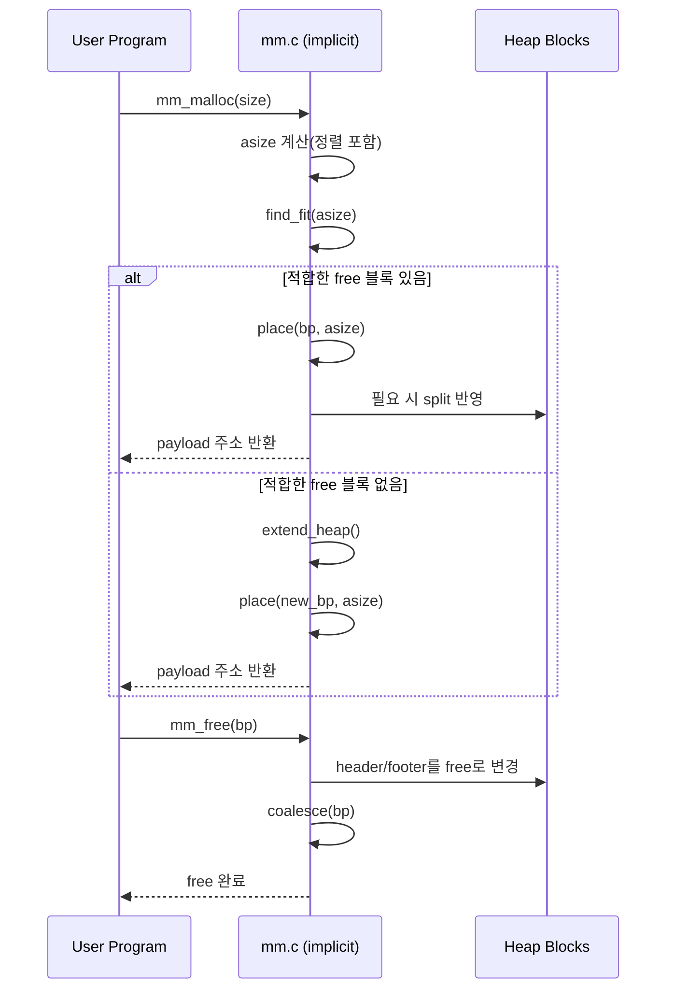
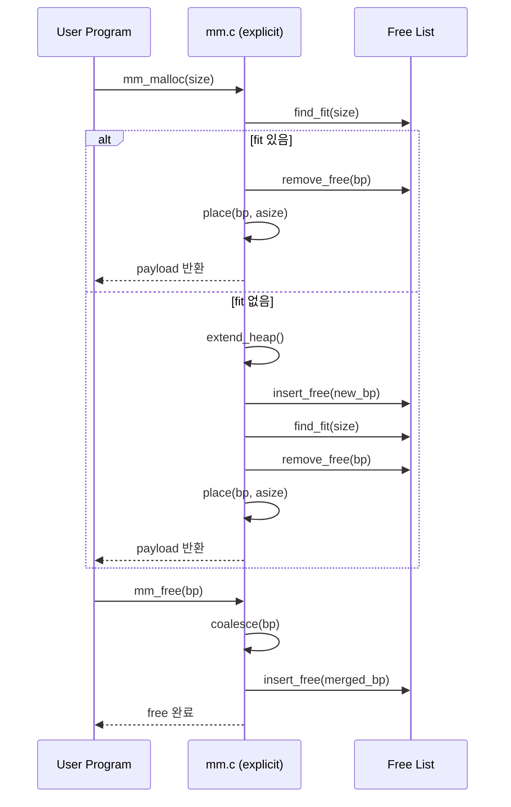

# Malloc Lab 설명대본 (구조화본)

이 문서는 발표용으로 바로 읽을 수 있게, 각 파트를 아래 틀로 통일했습니다.

- **핵심 동작 흐름**
- **주요 함수**
- **코드**
- **한 줄 요약**

---

## 목차

1. 용어 먼저: alloc / free / realloc
2. 블록(Block) 구조와 8바이트 정렬
3. naive allocator
4. implicit free list
5. coalesce 4가지 케이스
6. split 조건과 최소 블록 크기
7. explicit free list
8. segregated free list
9. realloc 안전 패턴

---

## 1) 용어 먼저: alloc / free / realloc

### 핵심 동작 흐름

1. `alloc(malloc)`으로 메모리를 빌린다.
2. 필요하면 `realloc`으로 크기를 바꾼다.
3. 다 쓴 뒤 `free`로 반납한다.

### 주요 함수

- `malloc(size)`
- `free(ptr)`
- `realloc(ptr, new_size)`

### 코드

```c
#include <stdlib.h>

int *data = (int *)malloc(3 * sizeof(int));   // alloc
if (data == NULL) return;

data[0] = 10;
data[1] = 20;
data[2] = 30;

int *tmp = (int *)realloc(data, 6 * sizeof(int)); // 크기 변경
if (tmp != NULL) {
    data = tmp;
    data[3] = 40;
}

free(data);   // 반납
data = NULL;
```

### 한 줄 요약

메모리 사용의 기본 사이클은 **할당 -> 크기 조정 -> 해제**입니다.

---

## 2) 블록(Block) 구조와 8바이트 정렬

### 핵심 동작 흐름

1. 블록은 `Header | Payload | Footer(선택)`로 본다.
2. Header에는 `size + alloc bit`를 저장한다.
3. `mm_malloc`이 반환하는 payload 포인터는 8바이트 정렬이어야 한다.

### **1) 블록을** `Header | Payload | Footer(선택)`**으로 보는 이유**

**역할을 나누기 위해서**입니다.

- **Header**: “이 블록이 얼마나 길고, 지금 할당됐는지” 같은 **메타데이터**를 넣는 구간입니다. 사용자 코드가 직접 쓰는 영역이 아닙니다.
- **Payload**: `malloc`이 돌려주는 주소가 가리키는 **실제 사용 영역**입니다.
- **Footer**: **선택**인 이유는, 설계에 따라 필요 없을 수 있기 때문입니다.
  - **Implicit free list + 역방향 병합(coalesce)**에서는 이전 블록이 free인지, 그 블록 크기가 얼마인지 알아야 해서, **헤더와 같은 정보를 블록 끝에 한 번 더 두는(footer) 패턴**이 흔합니다.
  - 반대로 **explicit list**처럼 free 블록만 링크로 연결하고, 할당 블록은 푸터 없이 가는 식이면 푸터를 생략할 수 있습니다.

즉 “힙을 사용자 바이트만으로는 설명할 수 없고, 앞(뒤)에 붙는 관리 정보와 중간의 사용자 영역을 구분해서 말하자”는 **모델링**입니다.

### **2) Header에** `size + alloc bit`**를 넣는 이유**

**한 블록의 경계를 찾고, 인접 블록과 합칠 수 있게 하려면** 최소한 다음이 필요합니다.

1. **크기(size)**

다음 블록 주소는 대략 `현재 payload 시작 + 블록 전체 크기`로 계산됩니다(문서의 `NEXT_BLKP` 같은 매크로). 크기를 모르면 힙을 순차 순회할 수 없습니다.
2. **할당 여부(alloc bit)**  
`free` 직후 **앞/뒤 블록이 free면 병합**하는데, “옆 블록이 free인지”를 비트 하나로 표시하는 게 가장 작고 빠릅니다.
3. **한 워드에 같이 넣는 이유(PACK)**  
크기는 보통 **8바이트 정렬** 때문에 하위 3비트가 항상 0이라는 전제를 쓰면, 그 자리에 alloc 비트(0/1)를 **겹쳐서** 저장할 수 있습니다. 메모리를 덜 쓰고, 한 번의 읽기/쓰기로 상태를 다룰 수 있습니다.

### 주요 함수

- (매크로 중심) `ALIGN`, `PACK`, `GET_SIZE`, `GET_ALLOC`
- `HDRP`, `FTRP`, `NEXT_BLKP`, `PREV_BLKP`

### 코드

```c
#define WSIZE 4 // 워드 한칸을 말한다 헤드의 사이즈를 뜻하는 느낌
#define DSIZE 8 // 헤드랑 푸터의 사이즈를 합쳤다. 쓰는 이유는 페이로드 시작주소에서 전체사이즈에서 이값을 뺸값을 더하게 되면 푸터의 주소를 알수 있기 때문
#define ALIGN(size) (((size) + 7) & ~0x7) //SIZE를 올림해서 8의 배수로 맞춘다. 이유는 할당할 메모리를 8의 배수로 맞추는작업이라생각하면 된다. 이를 위해서 7을 더하고 8의 배수로 내림을 해서 필요한 메모리를 맞게 할당을 한다

#define PACK(size, alloc) ((size) | (alloc)) // 블록의 전체 크기와 할당비트를(ALLOC)을 넣는다.
#define GET(p) (*(unsigned int *)(p)) // 주소가 가르키는 곳에서 워드 하나를 읽는 함수
#define PUT(p, val) (*(unsigned int *)(p) = (val)) // 주어진 주소에 워드 하나를 쓰는 함수

#define GET_SIZE(p)  (GET(p) & ~0x7) // 워드에서 사이즈를 가져오는 함수
#define GET_ALLOC(p) (GET(p) & 0x1) // 워드에서 할당비트를 가져오는 함수

#define HDRP(bp) ((char *)(bp) - WSIZE) // 헤드 주소를 가져오는 함수 bp는 페이로드 시작주소니까 헤드크기만 빼면 됌
#define FTRP(bp) ((char *)(bp) + GET_SIZE(HDRP(bp)) - DSIZE) // 푸터 시작주소 를가져오는 함수 bp에서 (전체사이즈 - 8)을 더하면 됌
#define NEXT_BLKP(bp) ((char *)(bp) + GET_SIZE(HDRP(bp))) // 다음 블록의 bp
#define PREV_BLKP(bp) ((char */*char의 바이트는 1 그래서 1바이트 단위 주소연산이 가능*/)(bp) - GET_SIZE(((char *)(bp) - DSIZE))) // 이전 블록의 bp(이전 블록에 푸터가 있어야 가능함)
```

### 한 줄 요약

이 파트를 이해하면 이후 모든 방식의 코드가 읽히기 시작합니다.

---

## 3) naive allocator

### 먼저 왜 보나? (도입)

naive allocator는 **가장 단순한 기준점(baseline)** 입니다.  
이 방식을 먼저 이해하면, 뒤에서 나오는 implicit/explicit/segregated가
무엇을 개선하는지 명확하게 보입니다.

### 요청별 동작 (한눈에)

1. `mm_malloc(size)`
  - `ALIGN(size + SIZE_T_SIZE)`로 정렬된 크기를 계산합니다.
  - `mem_sbrk(newsize)`로 힙 끝을 늘려 새 블록을 받습니다.
  - 블록 앞에 요청 크기를 저장하고(payload 앞), 사용자에게 payload 주소를 반환합니다.
2. `mm_free(ptr)`
  - 이 구현에서는 아무 일도 하지 않습니다(no-op).
3. `mm_realloc(ptr, size)`
  - `mm_malloc(size)`로 새 블록을 받고,
  - 기존 내용을 `memcpy`로 복사한 뒤,
  - 기존 포인터를 `mm_free`에 넘기고 새 포인터를 반환합니다.

### 시퀀스 다이어그램




### 전체 시퀀스 해설 (순서대로)

1. `mm_malloc(size)`는 정렬된 크기를 계산한 뒤 `mem_sbrk`로 힙 끝을 늘려 새 블록을 받습니다.
2. `mem_sbrk`가 실패하면 `NULL`을 반환하고, 성공하면 요청 크기를 기록한 뒤 payload 주소를 반환합니다.
3. `mm_free(ptr)`는 이 naive 구현에서 실제 해제 동작 없이 종료됩니다(no-op).
4. `mm_realloc(oldptr, size)`는 새 블록 할당 → 데이터 복사 → 기존 포인터 전달(`mm_free`) 순서로 동작합니다.

### 다이어그램 읽는 포인트

- naive 방식은 **free 리스트 탐색 자체가 없고**, 필요할 때마다 힙 끝을 늘립니다.
- `mm_free`가 no-op이라서, 해제한 공간이 다음 `mm_malloc`에서 **재사용되지 않습니다**.
- `mm_realloc`은 기존 블록을 확장하지 않고, **새로 할당 + 복사 + (형식상)해제** 패턴으로 동작합니다.

### 한계와 다음 단계

- 장점: 구현이 매우 쉽고 동작이 단순해 디버깅 출발점으로 좋습니다.
- 단점: 해제 공간 재사용이 없어 메모리 효율과 성능이 빠르게 나빠집니다.
- 그래서 다음 단계인 `4) implicit free list`에서
"빈 블록을 찾고(`find_fit`), 배치하고(`place`), 병합하는(`coalesce`) 구조"로 확장합니다.

### 주요 함수

- `mm_malloc`: 새 공간을 요청해 payload 포인터를 돌려줍니다.
- `mm_free`: naive에서는 no-op입니다.
- `mm_realloc`: 새로 할당하고 복사한 뒤 기존 포인터를 넘깁니다.
- `mem_sbrk`: 힙 끝(brk)을 증가시켜 새 메모리 구간을 제공합니다.

### 코드

```c
/* single word (4) or double word (8) alignment */
#define ALIGNMENT 8

/* rounds up to the nearest multiple of ALIGNMENT */
#define ALIGN(size) (((size) + (ALIGNMENT - 1)) & ~0x7)

/* naive 블록 앞에 요청 크기(size_t 한 칸)를 저장하기 위한 공간.
 * sizeof(size_t)를 8바이트 경계로 올린 값(보통 64비트면 8). */ 
#define SIZE_T_SIZE (ALIGN(sizeof(size_t)))

/*
 * mm_init - initialize the malloc package.
 */
int mm_init(void)
{
    return 0;
}

/*
 * mm_malloc - Allocate a block by incrementing the brk pointer.
 *     Always allocate a block whose size is a multiple of the alignment.
 */
void *mm_malloc(size_t size)
{
    /* 사이즈를 받아서 사이즈랑 헤더의 크기를 더하고 */
    int newsize = ALIGN(size + SIZE_T_SIZE);
    /* mem_sbrk(incr): 힙을 incr 바이트만큼 늘리고, 이번에 새로 잡힌 구간의 시작 주소 반환.
     * 실패 시 (void *)-1 (memlib.c 참고). Lab에서 sbrk를 대신하는 시뮬레이션 함수. */
    void *p = mem_sbrk(newsize);
    if (p == (void *)-1)/* (void *)는 포인터 타입인데 사용하는 이유는 힙의 시작 주소를 반환하기 위해서*/
        return NULL;
    else
    {
        /* 블록 맨 앞 size_t에 "사용자가 요청한 바이트 수"만 저장 (나중에 realloc 등에서 사용) */
        *(size_t *)p = size;
        /* 사용자에게는 헤더 다음부터(페이로드)만 넘김 → 8바이트 정렬 유지 */
        return (void *)((char *)p + SIZE_T_SIZE);
    }
}

/*
 * mm_free - Freeing a block does nothing.
 */
void mm_free(void *ptr)
{
}

/*
 * mm_realloc - Implemented simply in terms of mm_malloc and mm_free
 */
void *mm_realloc(void *ptr, size_t size) // 이전 블록의 주소와 새로운 블록의 크기를 받아서 새로운 블록을 할당하고 이전 블록의 내용을 새로운 블록에 복사하고 이전 블록을 해제하고 새로운 블록을 반환
{
    void *oldptr = ptr; // 이전 블록의 주소
    void *newptr; // 새로운 블록의 주소
    size_t copySize; // 복사할 크기

    newptr = mm_malloc(size); // 새로운 블록을 할당
    if (newptr == NULL) // 새로운 블록을 할당하지 못했다면 NULL을 반환
        return NULL;
    copySize = *(size_t *)((char *)oldptr - SIZE_T_SIZE); // 이전 블록의 크기를 복사
    if (size < copySize) // 새 요청 크기(size)가 이전보다 작으면
        copySize = size; // 복사할 크기를 size로 설정 (앞부분만 복사).
    memcpy(newptr, oldptr, copySize); // 이전 블록의 내용을 새로운 블록에 복사
    mm_free(oldptr); // 이전 블록을 해제
    return newptr; // 새로운 블록을 반환
}
```

### 한 줄 요약

**가장 단순하지만 재사용이 없어 비효율적**인 출발점입니다.

---

## 4) implicit free list (힙 전체 순회)

### 먼저 왜 보나? (도입)

implicit free list는 naive에서 한 단계 발전한 **첫 실전형 구조**입니다.  
해제 블록을 재사용하기 시작하면서, 성능/이용률 개선의 출발점이 됩니다.

### 요청별 동작 (한눈에)

1. `mm_malloc(size)`
  - 정렬된 요청 크기를 만든 뒤 `find_fit`으로 힙 전체를 순회해 맞는 free 블록을 찾습니다.
  - 찾으면 `place`로 배치하고, 남는 공간이 충분하면 split합니다.
  - 못 찾으면 힙을 확장(`extend_heap`)해 새 free 블록을 만든 뒤 다시 배치합니다.
2. `mm_free(bp)`
  - 현재 블록의 header/footer를 free로 바꾼 뒤 `coalesce`로 인접 free 블록과 병합합니다.

### 시퀀스 다이어그램




### 전체 흐름 해설 (순서대로)

1. implicit의 핵심은 "힙 전체 블록을 순회해 재사용 가능한 free 블록을 찾는 것"입니다.
2. 할당 시에는 `find_fit`으로 후보를 찾고, `place`에서 split 여부를 결정합니다.
3. 해제 시에는 즉시 `coalesce`를 수행해 단편화를 줄이고 다음 요청의 재사용 가능성을 높입니다.
4. 즉, 이 구조는 "탐색(할당 시) + 병합(해제 시)"의 두 축으로 돌아갑니다.

### 주요 함수

- `mm_init`: 프롤로그/에필로그와 초기 free 블록을 만들어 탐색 가능한 힙 구조를 준비합니다.
- `find_fit`: 힙을 선형 순회하며 요청 크기를 만족하는 첫 free 블록을 찾습니다(first-fit).
- `place`: 선택한 free 블록에 할당을 반영하고, 여유가 충분하면 split해서 나머지를 free로 남깁니다.
- `coalesce`: 방금 free된 블록을 인접 free 블록과 병합해 단편화를 줄입니다.
- `mm_malloc`/`mm_free`: 각각 "탐색+배치", "free 표시+병합"의 진입점입니다.

### 코드

```c
/* 기본 상수 */
#define ALIGNMENT 8 // 8바이트 정렬
#define ALIGN(size) (((size) + (ALIGNMENT - 1)) & ~(ALIGNMENT - 1)) // 8바이트 정렬을 위한 매크로

#define WSIZE 4 // 4바이트
#define DSIZE 8 // 8바이트
#define CHUNKSIZE (1 << 12) // 4096바이트

#define MAX(x, y) ((x) > (y) ? (x) : (y)) // 두 값 중 큰 값을 반환

#define PACK(size, alloc) ((size_t)(size) | (size_t)(alloc)) // 크기와 할당 상태를 패킹

#define GET(p) (*(unsigned int *)(p)) // 포인터 p의 값을 반환
#define PUT(p, val) (*(unsigned int *)(p) = (val)) // 포인터 p의 값을 val로 설정

#define GET_SIZE(p) (GET(p) & ~0x7) // 포인터 p의 크기를 반환
#define GET_ALLOC(p) (GET(p) & 0x1) // 포인터 p의 할당 상태를 반환  

#define HDRP(bp) ((char *)(bp)-WSIZE) // 헤더 포인터를 반환
#define FTRP(bp) ((char *)(bp) + GET_SIZE(HDRP(bp)) - DSIZE) // 푸터 포인터를 반환
#define NEXT_BLKP(bp) ((char *)(bp) + GET_SIZE(HDRP(bp))) // 다음 블록 포인터를 반환
#define PREV_BLKP(bp) ((char *)(bp)-GET_SIZE((char *)(bp)-DSIZE)) // 이전 블록 포인터를 반환

static char *heap_listp; // 힙 리스트 포인터

static void *coalesce(void *bp); // 병합
static void *extend_heap(size_t words); // 힙 확장
static void *find_fit(size_t asize); // 할당 가능한 블록 찾기
static void place(void *bp, size_t asize); // 할당

/*
 * mm_init - prologue / epilogue 세팅 후 힙 준비
 */
int mm_init(void)
{
    if ((heap_listp = mem_sbrk(4 * WSIZE)) == (void *)-1) // 힙 리스트 포인터를 설정
        return -1;
    PUT(heap_listp, 0); // 힙 리스트 포인터를 0으로 설정
    PUT(heap_listp + (1 * WSIZE), PACK(DSIZE, 1)); // 힙 리스트 포인터 + 1 * 4바이트를 패킹
    PUT(heap_listp + (2 * WSIZE), PACK(DSIZE, 1)); // 힙 리스트 포인터 + 2 * 4바이트를 패킹
    PUT(heap_listp + (3 * WSIZE), PACK(0, 1)); // 힙 리스트 포인터 + 3 * 4바이트를 패킹
    heap_listp += (2 * WSIZE); // 힙 리스트 포인터를 2 * 4바이트 만큼 증가
    return 0; // 성공
}

/*
 * extend_heap - epilogue 자리부터 free 블록 + 새 epilogue
 */
static void *extend_heap(size_t words) // 힙 확장
{
    char *bp; // 블록 포인터
    size_t size; // 블록 크기

    size = (words % 2) ? (words + 1) * WSIZE : words * WSIZE; // 블록 크기를 설정
    if ((bp = mem_sbrk((int)size)) == (void *)-1) 
        return NULL; // 실패

    PUT(HDRP(bp), PACK(size, 0)); // 헤더 포인터를 설정
    PUT(FTRP(bp), PACK(size, 0)); // 푸터 포인터를 설정
    PUT(HDRP(NEXT_BLKP(bp)), PACK(0, 1)); // 다음 블록 포인터를 설정

    return coalesce(bp); // 
}


/*
 * find_fit - first fit
 */
static void *find_fit(size_t asize) // 할당 가능한 블록 찾기
{
    void *bp; // 블록 포인터

    for (bp = heap_listp; GET_SIZE(HDRP(bp)) > 0; bp = NEXT_BLKP(bp)) // 힙 리스트 포인터부터 시작하여 다음 블록 포인터까지 순회
    {
        if (!GET_ALLOC(HDRP(bp)) && (asize <= GET_SIZE(HDRP(bp)))) // 블록이 할당되지 않았고 요청 크기가 블록 크기보다 작다면
            return bp; // 블록 포인터를 반환
    }
    return NULL; // 실패
}


/*
 * mm_malloc
 */
void *mm_malloc(size_t size) // 요청 크기를 받아서 할당 가능한 블록 찾기        
{
    size_t asize; // 요청 크기
    size_t extendsize; // 확장 크기
    char *bp; // 블록 포인터

    if (size == 0)
        return NULL; // 실패 (요청 크기가 0이면 NULL을 반환)

    if (size <= DSIZE)
        asize = 2 * DSIZE; // 요청 크기가 8바이트보다 작다면 8바이트로 설정
    else
        asize = DSIZE * ((size + (DSIZE) + (DSIZE - 1)) / DSIZE); // 요청 크기를 8바이트 경계로 올림

    if ((bp = find_fit(asize)) != NULL) // 할당 가능한 블록 찾기        
    {
        place(bp, asize); // 할당
        return bp;
    }

    extendsize = MAX(asize, CHUNKSIZE);
    if ((bp = extend_heap(extendsize / WSIZE)) == NULL)
        return NULL; // 실패 (확장 크기가 0이면 NULL을 반환)
    place(bp, asize); // 할당
    return bp; // 블록 포인터를 반환
}

/*
 * mm_free
 */
void mm_free(void *ptr) // 블록 포인터를 받아서 해제
{
    if (ptr == NULL)
        return; // 실패 (블록 포인터가 NULL이면 실패)

    size_t size = GET_SIZE(HDRP(ptr)); // 블록 크기

    PUT(HDRP(ptr), PACK(size, 0)); // 헤더 포인터를 설정
    PUT(FTRP(ptr), PACK(size, 0)); // 푸터 포인터를 설정
    coalesce(ptr); // 병합
}

/*
 * mm_realloc - 새 블록 할당 후 복사 (단순 패턴)
 */
void *mm_realloc(void *ptr, size_t size) // 이전 블록의 주소와 새로운 블록의 크기를 받아서 새로운 블록을 할당하고 이전 블록의 내용을 새로운 블록에 복사하고 이전 블록을 해제하고 새로운 블록을 반환
{
    void *oldptr = ptr; // 이전 블록 포인터
    void *newptr; // 새로운 블록 포인터
    size_t copySize; // 복사할 크기

    if (ptr == NULL)
        return mm_malloc(size); // 실패 (블록 포인터가 NULL이면 새로운 블록을 할당하고 반환)   
    if (size == 0)
    {
        mm_free(ptr); // 이전 블록을 해제
        return NULL; // 실패 (새로운 블록을 할당하고 반환)
    }

    newptr = mm_malloc(size); // 새로운 블록을 할당하고 반환
    if (newptr == NULL)
        return NULL; // 실패 (새로운 블록을 할당하고 반환)

    copySize = GET_SIZE(HDRP(oldptr)) - DSIZE; // 복사할 크기를 설정
    if (size < copySize)
        copySize = size; // 복사할 크기를 설정
    memcpy(newptr, oldptr, copySize); // 이전 블록의 내용을 새로운 블록에 복사
    mm_free(oldptr); // 이전 블록을 해제
    return newptr; // 새로운 블록을 반환
}

```

### 한 줄 요약

**구현 난이도와 이해도가 좋은 기본형**이며, 학습 첫 타깃으로 적합합니다.

---

## 5) coalesce 4가지 케이스

### 먼저 왜 보나? (도입)

coalesce는 free 블록을 크게 만들어 재활용성을 높이는 **단편화 제어 핵심 로직**입니다.  
implicit/explicit/segregated 어디서든 안정적으로 구현해야 하는 공통 기반입니다.

### 동작 규칙 (한눈에)

1. 현재 free 블록 기준으로 이전/다음 블록의 할당 상태를 확인합니다.
2. `(prev alloc/free) x (next alloc/free)` 조합으로 4가지 케이스를 분기합니다.
3. 병합 후 header/footer를 새 크기로 다시 기록하고, 기준 포인터(`bp`)를 맞춥니다.

### 4케이스 분기표


| prev  | next  | 처리              | 결과 포인터               |
| ----- | ----- | --------------- | -------------------- |
| alloc | alloc | 병합 없음           | `bp` 유지              |
| alloc | free  | 현재 + 다음 병합      | `bp` 유지              |
| free  | alloc | 이전 + 현재 병합      | `bp = PREV_BLKP(bp)` |
| free  | free  | 이전 + 현재 + 다음 병합 | `bp = PREV_BLKP(bp)` |


### 전체 흐름 해설 (순서대로)

1. case 1: 양옆이 할당이면 현재 블록만 유지합니다.
2. case 2: 다음만 free면 현재+다음을 합치고 현재 위치를 유지합니다.
3. case 3: 이전만 free면 이전+현재를 합치고 기준 포인터를 이전 블록으로 옮깁니다.
4. case 4: 양옆 모두 free면 세 블록을 한 번에 합치고 기준 포인터를 이전 블록으로 옮깁니다.

### 주요 함수

- `coalesce`: 4케이스 분기를 수행해 병합 범위를 결정하고 header/footer를 갱신합니다.
- `GET_ALLOC`/`GET_SIZE`: 인접 블록의 할당 여부와 크기를 읽어 분기 조건을 만듭니다.
- `HDRP`/`FTRP`: 병합 결과를 헤더/푸터에 기록할 위치를 계산합니다.
- `NEXT_BLKP`/`PREV_BLKP`: 병합 대상 블록 경계를 탐색할 때 사용합니다.

### 코드

```c
/*
 * coalesce - 앞/뒤 free면 4가지 케이스로 병합
 */
static void *coalesce(void *bp)
{
    size_t prev_alloc = GET_ALLOC(FTRP(PREV_BLKP(bp)));
    size_t next_alloc = GET_ALLOC(HDRP(NEXT_BLKP(bp)));
    size_t size = GET_SIZE(HDRP(bp));

    if (prev_alloc && next_alloc)
        return bp;

    if (prev_alloc && !next_alloc)
    {
        size += GET_SIZE(HDRP(NEXT_BLKP(bp)));
        PUT(HDRP(bp), PACK(size, 0));
        PUT(FTRP(bp), PACK(size, 0));
    }
    else if (!prev_alloc && next_alloc)
    {
        size += GET_SIZE(HDRP(PREV_BLKP(bp)));
        PUT(FTRP(bp), PACK(size, 0));
        PUT(HDRP(PREV_BLKP(bp)), PACK(size, 0));
        bp = PREV_BLKP(bp);
    }
    else
    {
        size += GET_SIZE(HDRP(PREV_BLKP(bp))) + GET_SIZE(HDRP(NEXT_BLKP(bp)));
        PUT(HDRP(PREV_BLKP(bp)), PACK(size, 0));
        PUT(FTRP(NEXT_BLKP(bp)), PACK(size, 0));
        bp = PREV_BLKP(bp);
    }
    return bp;
}

```

### 한 줄 요약

coalesce는 단편화 완화의 핵심이며, 4케이스를 정확히 처리해야 합니다.

---

## 6) split 조건과 최소 블록 크기

### 먼저 왜 보나? (도입)

split은 "한 블록을 얼마나 잘게 나눌지"를 결정하는 **공간 활용 최적화 포인트**입니다.  
너무 공격적으로 자르면 작은 조각이 쌓이고, 너무 보수적이면 내부 단편화가 늘어납니다.

### 동작 규칙 (한눈에)

1. 선택된 free 블록에서 요청 크기(`asize`)를 먼저 배치합니다.
2. 남는 크기(`csize - asize`)가 최소 블록 크기 이상이면 split합니다.
3. 남는 크기가 너무 작으면 분할하지 않고 블록 전체를 할당 처리합니다.

### split 판단 다이어그램

```mermaid
flowchart TD
    A[place(bp, asize)] --> B[csize = GET_SIZE(HDRP(bp))]
    B --> C{csize - asize >= 2 * DSIZE ?}
    C -->|Yes| D[앞부분 asize를 alloc으로 기록]
    D --> E[뒷부분을 새 free 블록으로 기록]
    C -->|No| F[블록 전체를 alloc으로 기록]
```


### 전체 흐름 해설 (순서대로)

1. `place`는 먼저 현재 free 블록 크기(`csize`)를 읽습니다.
2. `csize - asize`를 최소 블록 조건(예: `2 * DSIZE`)과 비교합니다.
3. 조건을 만족하면 "할당 블록 + 새 free 블록" 두 개로 나눕니다.
4. 조건을 못 만족하면 쪼개지 않고 통째로 할당해 깨진 작은 블록 생성을 막습니다.

### 주요 함수

- `place`: split 여부를 판단해 "쪼개서 할당" 또는 "통째 할당"을 결정하는 핵심 함수입니다.
- `GET_SIZE`: 현재 free 블록 크기(`csize`)를 읽어 판단식의 입력을 제공합니다.
- `HDRP`/`FTRP`: 분할된 앞/뒤 블록의 메타데이터 기록 위치를 계산합니다.
- `PUT`: header/footer에 최종 크기와 할당 비트를 실제로 씁니다.

### 코드

```c
/*
 * place - 할당 표시, 남는 공간이 최소 free 블록 이상이면 split
 */
static void place(void *bp, size_t asize) 
{
    size_t csize = GET_SIZE(HDRP(bp)); // 블록 크기

    if ((csize - asize) >= (2 * DSIZE)) // 블록 크기가 요청 크기보다 크다면
    {
        PUT(HDRP(bp), PACK(asize, 1)); // 헤더 포인터를 설정
        PUT(FTRP(bp), PACK(asize, 1)); // 푸터 포인터를 설정
        bp = NEXT_BLKP(bp); // 다음 블록 포인터를 설정
        PUT(HDRP(bp), PACK(csize - asize, 0)); // 헤더 포인터를 설정
        PUT(FTRP(bp), PACK(csize - asize, 0)); // 푸터 포인터를 설정
    }
    else
    {
        PUT(HDRP(bp), PACK(csize, 1)); // 헤더 포인터를 설정
        PUT(FTRP(bp), PACK(csize, 1)); // 푸터 포인터를 설정
    }
}

```

### 한 줄 요약

split 조건이 느슨하면 블록이 깨지고, 너무 보수적이면 이용률이 떨어집니다.

---

## 7) explicit free list (free 블록만 순회)

### 먼저 왜 보나? (도입)

explicit free list는 implicit의 선형 탐색 비용을 줄이기 위한 구조입니다.  
핵심은 "힙 전체"가 아니라 "free 블록 집합"만 관리해서 탐색 범위를 줄이는 데 있습니다.

### 요청별 동작 (한눈에)

1. `mm_malloc(size)`
  - free 리스트에서 적합한 블록을 찾습니다.
  - 찾은 블록은 리스트에서 제거(`remove_free`)한 뒤 할당/필요 시 split합니다.
  - 못 찾으면 힙 확장 후 새 free 블록을 리스트에 넣고 다시 배치합니다.
2. `mm_free(bp)`
  - 블록을 free로 표시하고 `coalesce`로 병합한 뒤 free 리스트에 삽입(`insert_free`)합니다.

### 시퀀스 다이어그램




### 전체 흐름 해설 (순서대로)

1. explicit은 free 블록 payload 안에 `prev/next` 포인터를 둬서 이중 연결 리스트를 구성합니다.
2. 할당 시에는 free 리스트만 순회하므로 implicit 대비 탐색량이 줄어드는 경우가 많습니다.
3. free/병합 시에는 리스트 연결을 먼저 정확히 갱신해야 일관성이 깨지지 않습니다.
4. 즉, explicit의 성능 이점은 크지만 구현 난점은 "포인터 연결 무결성"에 있습니다.

### 주요 함수

- `insert_free`: free(또는 병합 완료) 블록을 free 리스트 정책(LIFO 등)에 맞춰 삽입합니다.
- `remove_free`: 할당 대상 블록을 리스트에서 안전하게 분리해 dangling link를 막습니다.
- `find_fit`(free list 버전): free 리스트만 순회해 요청 크기에 맞는 블록을 탐색합니다.
- `coalesce`: 인접 free 블록 병합 후, 결과 블록 기준으로 리스트 재연결을 맞춥니다.

### 코드

```c
#define PRED(bp) (*(void **)(bp))
#define SUCC(bp) (*(void **)((char *)(bp) + sizeof(void *)))

static void insert_free(void *bp) {       // LIFO 삽입 예시
    SUCC(bp) = free_list_head;
    PRED(bp) = NULL;
    if (free_list_head) PRED(free_list_head) = bp;
    free_list_head = bp;
}

static void remove_free(void *bp) {
    if (PRED(bp)) SUCC(PRED(bp)) = SUCC(bp);
    else free_list_head = SUCC(bp);
    if (SUCC(bp)) PRED(SUCC(bp)) = PRED(bp);
}
```

### 한 줄 요약

탐색은 빨라지지만, **리스트 일관성 관리가 핵심 난관**입니다.

---

## 8) segregated free list (크기별 리스트)

### 먼저 왜 보나? (도입)

segregated free list는 explicit을 더 확장해 **크기 클래스별 free 리스트**를 둔 구조입니다.  
요청 크기와 비슷한 블록을 먼저 찾도록 해서 처리량과 적합도를 동시에 개선하려는 방식입니다.

### 요청별 동작 (한눈에)

1. `mm_malloc(size)`
  - `class_index(size)`로 시작 클래스 인덱스를 결정합니다.
  - 해당 클래스부터 상위 클래스로 올라가며 fit을 탐색합니다.
  - fit을 찾으면 제거 후 배치/분할하고, 없으면 힙 확장 후 재시도합니다.
2. `mm_free(bp)`
  - free/병합 후 최종 블록 크기에 맞는 클래스에 삽입합니다.

### 클래스 탐색 다이어그램

```mermaid
flowchart TD
    A[mm_malloc(asize)] --> B[idx = class_index(asize)]
    B --> C[리스트 idx에서 fit 탐색]
    C --> D{fit 존재?}
    D -->|Yes| E[remove_free -> place -> 반환]
    D -->|No| F[idx+1 상위 클래스 탐색]
    F --> G{마지막 클래스까지 확인?}
    G -->|No| C
    G -->|Yes| H[extend_heap 후 재탐색]
```


### 전체 흐름 해설 (순서대로)

1. 요청 크기를 클래스 인덱스로 매핑해 "비슷한 크기 그룹"부터 찾는 것이 출발점입니다.
2. 같은 클래스에 없으면 상위 클래스로 점진적으로 넓혀 탐색합니다.
3. 해제 시에는 병합 결과 크기에 맞는 클래스로 다시 배치해 리스트 품질을 유지합니다.
4. 이 구조는 빠르지만, 클래스 경계/삽입 정책/탐색 정책 튜닝이 성능을 크게 좌우합니다.

### 주요 함수

- `class_index`: 블록 크기를 클래스 번호로 변환해 시작 탐색 지점을 정합니다.
- `find_fit_from_class`: 시작 클래스부터 상위 클래스로 확장하며 적합 블록을 찾습니다.
- `insert_free`: 병합 완료 블록을 크기에 맞는 리스트에 넣어 다음 탐색 효율을 유지합니다.
- `remove_free`: 할당 대상 블록을 해당 리스트에서 분리해 구조 일관성을 보장합니다.

### 코드

```c
#define LISTS 16
static void *seg_heads[LISTS];

static int class_index(size_t size) {
    int idx = 0;
    while (idx < LISTS - 1 && size > 1) {
        size >>= 1;
        idx++;
    }
    return idx;
}

static void *find_fit_from_class(size_t asize) {
    int i = class_index(asize);
    for (; i < LISTS; i++) {
        // seg_heads[i] 순회해서 fit 찾기
    }
    return NULL;
}
```

### 한 줄 요약

처리량 개선에 유리하지만, **구현량과 튜닝 포인트가 가장 많습니다**.

---

## 9) realloc 안전 패턴

### 핵심 동작 흐름

1. 새 크기로 `realloc` 요청 시 바로 원본 포인터를 덮어쓰지 않는다.
2. 임시 포인터(`tmp`)에 결과를 받는다.
3. 성공 시에만 원본 포인터를 갱신한다.

### 주요 함수

- `realloc`
- `malloc`, `free` (실패 시 대응)

### 코드

```c
int *arr = (int *)malloc(4 * sizeof(int));
if (arr == NULL) return;

int *tmp = (int *)realloc(arr, 8 * sizeof(int));
if (tmp == NULL) {
    // 실패 시 기존 arr는 아직 유효
    free(arr);
    return;
}
arr = tmp;
```

### 한 줄 요약

`arr = realloc(arr, ...)`를 바로 쓰면 실패 시 원본 포인터를 잃을 수 있습니다.